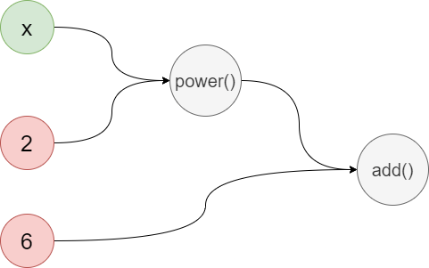
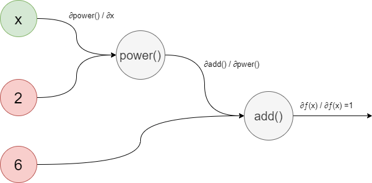

# Auto-Differentiation-Package
An Auto-Differentiation-Package for Machine learning and Deep learning
This package created by @Faris-ML
### How to differentiate automaticlly?

The derivative is taken by going throuth the following steps:

1- Define the equation by the package operator

2- Create a graph

3- compute the forward pass and backward pass

### Methodology:

The way to be able to take derivative is to convert the equation to graph.

example:

let say that we want to evaluate this equation

y = (x^2)+6

after converting the equation to graph will be like this:

and by the chain rule we compute the gradients by taking the backward pass like the graph below :

### Classes
* Graph: graph class that convert equation to graph data structure
* Node: a nodes class that contains three types of nodes

# Types of nodes
1 - Variable
2 - Constant
3 - Operator
